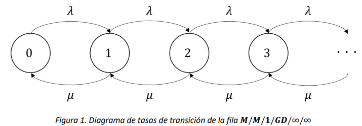
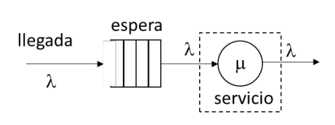
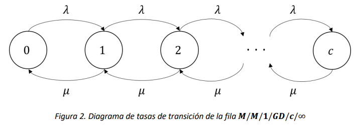
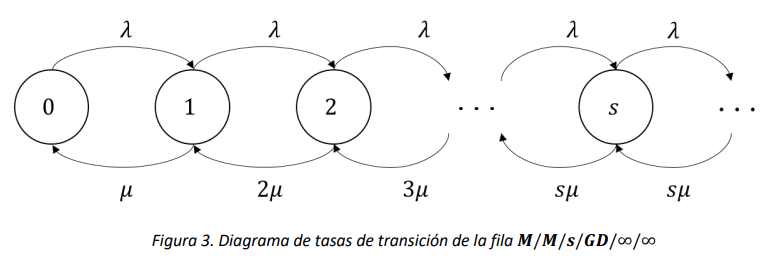

# Teoría de Colas

En este capítulo se presenta el desarrollo de las medidas de desempeño
para algunos procesos de nacimiento y muerte, también conocidos como
filas en Teoría de Colas.

## Notación Kendall-Lee

Para poder analizar las medidas de desempeño de algunas de las
diferentes configuraciones de filas que se pueden presentar en un
sistema, resulta de utilidad abordar primero el concepto de notación
Kendall-Lee. En dicha notación se encuentran 6 posiciones:

$$A/B/C/D/E/F$$

Donde:

-   $A$: Representa el tipo de proceso estocástico o distribución de
    probabilidad asociada a la llegada de entidades al sistema.

-   $B$: Representa el tipo de proceso estocástico o distribución de
    probabilidad asociada a la atención o servicio de entidades en el
    sistema.

-   $C$: Representa el número de servidores con los que cuenta el
    sistema para la atención de las entidades.

-   $D$: Representa la disciplina o el comportamiento en la atención de
    las entidades en el sistema.

-   $E$: Representa la capacidad máxima de entidades que pueden
    encontrarse al mismo tiempo el sistema, tanto en fila como en
    servicio.

-   $F$: Representa el tamaño de la población de la cual provienen las
    entidades por fuera del sistema.

> En general, para los elementos $A$ y $B$, se utiliza una letra $M$
> cuando el proceso correspondiente sigue un Proceso de Poisson con una
> tasa respectiva. Para cualquier otra distribución que no siga un
> Proceso de Poisson, se utiliza una letra $G$ que representa una
> distribución general (i.e. una distribución uniforme continua para los
> procesos de arribo y/o atención de entidades). Para el parámetro D, se
> utiliza suelen especificar las letras $GD$ para hacer referencia a una
> disciplina general de atención de entidades, siendo esta disciplina
> "primero en entrar, primero en salir" (o FIFO, por sus siglas en
> inglés). Por último, para los parámetros $C,\ E$ y $F$, se puede
> especificar un número natural correspondiente para cada parámetro o,
> si dichos parámetros no están acotados por un número específico, se
> puede representar cada valor con el símbolo $\infty$ seg´´un
> corresponda.

## La fila $\mathbf{M/M/1/GD/\infty/\infty}$

De su notación de Kendall, esta es una fila en la cual el tiempo entre
arribos y el tiempo de servicio siguen una distribución exponencial (con
tasas que denotaremos $\lambda$ y $\mu$ respectivamente), sólo hay un
servidor, y tanto la capacidad del sistema como el tamaño de la
población son infinitos. La notación resumida de Kendall para esta cola
es $M/M/1$, ya que los últimos tres términos normalmente se omiten.

Así, la fila descrita se puede modelar como una Cadena de Markov de
tiempo continuo con variable de estado
$X(t) = número\ de\ entidades\ en\ el\ sistema\ en\ el\ instante\ t$. El
espacio de estados de la cadena es el conjunto infinito de los números
enteros no-negativos $S = \{ 0,1,2,\ldots\}$. Así, la Figura 1 muestra
el diagrama de tasas de transición correspondiente.

Note que esta cadena es un proceso de nacimiento y muerte, por lo que
las probabilidades de estado estable (si existen) tienen la forma:

$$\pi_{j} = c_{j}\pi_{0}$$

Donde $c_{j}$ se calcula a partir de $\lambda$ y $\mu$ así:

$$c_{j} = \frac{\lambda_{0}\lambda_{1}{\cdots\lambda}_{j - 1}}{\mu_{1}\mu_{2}\cdots{\ \mu}_{j}} = \frac{\lambda^{j}}{\mu^{j}} = \left( \frac{\lambda}{\mu} \right)^{j}$$

Así mismo, para conocer todas las probabilidades de estado estable sólo
es necesario encontrar $\pi_{0}$ como en cualquier proceso de nacimiento
y muerte:

$$\pi_{0} = \left( 1 + \sum_{j = 1}^{\infty}\left( \frac{\lambda}{\mu} \right)^{j} \right)^{- 1} = \left( \sum_{j = 0}^{\infty}\left( \frac{\lambda}{\mu} \right)^{j} \right)^{- 1}$$

La existencia de $\pi_{0}$, y por lo tanto, de todas las probabilidades
de estado estable, dependen de la serie infinita
$\sum_{j = 0}^{\infty}\left( \frac{\lambda}{\mu} \right)^{j}$, que
converge solo si $\left( \frac{\lambda}{\mu} \right) < 1$. Esta
condición es consistente con la interpretación física de la fila, porque
si $\mu < \lambda$, las entidades llegan a la fila más rápido de lo que
el servidor las puede atender, por lo que en el largo plazo la fila
tendrá una longitud infinita. En este caso, todos los estados de la
cadena serán transitorios, y por la tanto, si bien la cadena es
irreducible, no es ergódica, y las probabilidades de estado estable no
existirán. Así, denotaremos como $\rho = \frac{\lambda}{\mu}$ la
relación entre las tasas de llegada y servicio, y calculamos las
probabilidades en estado estable en función de $\rho:$

$$\pi_{0} = \left( \sum_{j = 0}^{\infty}\rho^{j} \right)^{- 1} = \left( \frac{1}{1 - \rho} \right)^{- 1} = 1 - \rho$$

La segunda igualdad en la expresión de arriba se obtiene de las
propiedades de las series geométricas, las cuales, cuando la razón de la
serie (en este caso el $\rho$) es estrictamente menor a 1, convergen al
valor finito $(1 - \rho)^{- 1}$

Ahora, es de interés conocer la utilización del servidor, es decir, la
fracción de tiempo que el servidor está ocupado en el largo plazo:

$$Utilización = \pi_{1} + \pi_{2} + \ldots = \sum_{j = 1}^{\infty}\pi_{j} = \sum_{j = 0}^{\infty}\pi_{j} - \pi_{0} = 1 - \pi_{0} = 1 - (1 - \rho) = \rho$$

Entonces, las probabilidades de estado estable tienen la forma
$\pi_{j} = (1 - \rho)\rho^{j},\ \ j \geq 0$. Así, es posible conocer el
número esperado de entidades en el sistema $(L)$ como sigue:

$$L = \sum_{j = 0}^{\infty}j\pi_{j} = \sum_{j = 0}^{\infty}j(1 - \rho)\rho^{j} = (1 - \rho)\sum_{j = 0}^{\infty}j\rho^{j} = (1 - \rho)\frac{\rho}{(1 - \rho)^{2}} = \frac{\rho}{1 - \rho}$$

De forma similar se puede encontrar el número esperado de entidades en
servicio $(L_{s})$:

$$L_{s} = 0 \cdot \pi_{0} + \sum_{j = 1}^{\infty}{1 \cdot \pi_{j}} = \sum_{j = 1}^{\infty}\pi_{j} = 1 - \pi_{0} = 1 - (1 - \rho) = \rho$$

Es también posible obtener $L_{s}$ a través de la aplicación de la Ley
de Little al subsistema constituido por el servidor de la cola. Como se
ilustra en la Figura 1, dado que la $M/M/1$ es ergódica, el flujo de
entidades que salen del sistema debe ser igual en intensidad al flujo de
entidades que ingresan al sistema, es decir, ambos tienen que ser de
tasa $\lambda$. Dada la naturaleza secuencial del modelo, primero la
espera y después el servidor, también el flujo de entidades que pasan de
esperar a servicio debe ser de tasa $\lambda$.

Entonces, aplicando la Ley de Little ($L_{s} = \lambda{\cdot W}_{s}$) al
sistema encerrado en el rectángulo con línea discontinua, podemos
obtener que en el estado estacionario el número promedio de entidades en
servicio es igual a la tasa de llegada $\lambda$ por el tiempo promedio
que cada una de ellas pasa en servicio, lo cual es
$W_{s} = \frac{1}{\mu}$. Se obtiene que:

$$L_{s} = \lambda{\cdot W}_{s} = \frac{\lambda}{\mu} = \rho$$

El número esperado de entidades en fila $(L_{q})$ es:

$$L_{q} = L - L_{s} = \frac{\rho}{1 - \rho} - \rho = \frac{\rho^{2}}{1 - \rho}$$

Finalmente, usando la ley de Little se pueden encontrar los tiempos
promedio de permanencia en el sistema $(W)$:

$$W = \frac{L}{\lambda} = \frac{\frac{\rho}{1 - \rho}}{\lambda} = \frac{1}{\mu(1 - \frac{\lambda}{\mu})\ } = \frac{1}{\mu - \lambda}$$

Dado que el tiempo promedio en servicio es $W_{s} = \frac{1}{\mu}$,
podemos calcular el tiempo promedio en espera de cada entidad como
sigue:

$$W_{q} = W - W_{s} = \frac{1}{\mu - \lambda} - \frac{1}{\mu} = \frac{\lambda}{\mu(\mu - \lambda)}$$

## La fila $\mathbf{M/M/1/GD/c/\infty}$

De su notación de Kendall, ésta es una fila en la cual el tiempo entre
arribos y el tiempo de servicio siguen una distribución exponencial (con
tasas que denotaremos $\lambda$ y $\mu$ respectivamente), sólo hay un
servidor, el tamaño de la población es infinito, y el sistema tiene
capacidad de $c$ entidades en total, es decir, en fila y en servicio. La
notación resumida para esta cola es $M/M/1/c$.

Así, la fila descrita se puede modelar como una Cadena de Markov de
tiempo continuo con variable de estado
$X(t) = número\ de\ entidades\ en\ el\ sistema\ en\ el\ instante\ t$.
Así, la Figura 2 muestra el diagrama de tasas de transición
correspondiente.

Note que esta cadena es un proceso de nacimiento y muerte, y qué además
siempre es ergódica ya que tiene espacio de estados finito, por lo que
las probabilidades de estado estable siempre existen y tienen la forma:

$$\pi_{j} = c_{j}\pi_{0}$$

Donde $c_{j}$ se calcula a partir de $\lambda$ y $\mu$ así:

$$c_{j} = \frac{\lambda_{0}\lambda_{1}{\cdots\lambda}_{j - 1}}{\mu_{1}\mu_{2}\cdots{\ \mu}_{j}} = \frac{\lambda^{j}}{\mu^{j}} = \left( \frac{\lambda}{\mu} \right)^{j} = \rho^{j}$$

Entonces, para conocer todas las probabilidades de estado estable solo
es necesario encontrar $\pi_{0}$ como en cualquier proceso de nacimiento
y muerte:

$$\pi_{0} = \left( 1 + \sum_{j = 1}^{c}\rho^{j} \right)^{- 1} = \left( \sum_{j = 0}^{c}\rho^{j} \right)^{- 1} = \frac{1 - \rho}{1 - \rho^{c + 1}}$$

Es importante observar que para este modelo el $\rho$ no corresponde a
la utilización del sistema, y que puede asumir valores arbitrariamente
grandes. En efecto, para calcular la utilización de este sistema se debe
considerar que cuando el sistema está en el estado $c$ (es decir, hay
$c - 1\ $entidades en fila) las llegadas se pierden. Por esto, se
calcula una *tasa efectiva* de entrada al sistema $(\lambda_{e})$ de la
siguiente forma:

$$\lambda_{e} = \lambda\pi_{0} + \lambda\pi_{1} + \ldots + \lambda\pi_{c - 1} + 0\pi_{c} = \lambda(\pi_{0} + \pi_{1} + \ldots + \pi_{c - 1}) = \lambda(1 - \pi_{c})$$

Y la utilización del sistema es
$\frac{\lambda\left( 1 - \pi_{c} \right)}{\mu} = \rho(1 - \pi_{c})$.

Finalmente, se calculan los números esperados de entidades y tiempos
promedio de forma similar a la fila
$M\text{/}M\text{/}1\text{/}GD\text{/}\infty\text{/}\infty$:

$$L = \sum_{j = 0}^{c}{j\rho^{j}\frac{1 - \rho}{1 - \rho^{c + 1}}} = \frac{\rho\lbrack 1 - (c + 1) \cdot \rho^{c} + c \cdot \rho^{c + 1}\rbrack}{(1 - \rho^{c + 1})(1 - \rho)}$$

$$L_{s} = \rho(1 - \pi_{c})$$

$$L_{q} = L - L_{s}$$

$$W = \frac{L}{\lambda_{e}}$$

$$W_{s} = \frac{1}{\mu}$$

$$W_{q} = W - W_{s}$$

Note que las fórmulas mencionadas fallan cuando $\rho = 1$, sin embargo,
en este caso se tiene que:

$$\pi_{0} = \left( 1 + \sum_{j = 1}^{c}\rho^{j} \right)^{- 1} = \left( 1 + \sum_{j = 1}^{c}1 \right)^{- 1} = \frac{1}{1 + c}$$

Además, ya que para cualquier estado $j\ $se tiene que $c_{j} = 1$,
todos los $\pi_{j} = \pi_{0}$. Esto quiere decir que, en estado estable,
el sistema estará en cualquier estado con la misma probabilidad. A
partir de esta definición de $\pi_{j}$ se pueden calcular las demás
medidas de desempeño como se hizo anteriormente. En particular, se puede
mostrar que cuando $\rho = 1$ se tiene que $L = \frac{c}{2}$.

## La fila $\mathbf{M/M/s/GD/\infty/\infty}$

De su notación de Kendall, esta es una fila en la cual el tiempo entre
arribos y el tiempo de servicio siguen una distribución exponencial (con
tasas que denotaremos $\lambda$ y $\mu$ respectivamente), hay múltiples
servidores, y tanto la capacidad del sistema como el tamaño de la
población son infinitos. La notación de Kendall resumida para esta fila
es $M/M/s$.

Así, la fila descrita se puede modelar como una Cadena de Markov de
tiempo continuo con variable de estado
$X(t) = número\ de\ entidades\ en\ el\ sistema\ en\ el\ instante\ t$.
Así, la Figura 3 muestra el diagrama de tasas de transición
correspondiente.

Para analizar esta fila en estado estable, es necesario que todos los
estados sean recurrentes, lo que se cumple siempre y cuando
$\frac{\lambda}{s \cdot \mu} < 1$. Esta cantidad se denota como
$\rho_{s}$ y es la utilización del sistema.

Note que esta cadena es un proceso de nacimiento y muerte, por lo que
las probabilidades de estado estable (si existen) tienen la forma:

$$\pi_{j} = c_{j}\pi_{0}$$

Donde $c_{j}$ se calcula a partir de $\lambda$ y $\mu$ así:

$$c_{j} = \left\{ \begin{matrix}
\frac{\left( s\rho_{s} \right)^{j}}{j!} & j < s \\
\frac{\left( s\rho_{s} \right)^{j}}{s!s^{j - s}} & j \geq s
\end{matrix} \right.\ $$

Y $\pi_{0}:$

$$\pi_{0} = \left( \sum_{j = 0}^{s - 1}\frac{\left( s\rho_{s} \right)^{j}}{j!} + \sum_{j = s}^{\infty}\frac{\left( s\rho_{s} \right)^{j}}{s!s^{j - s}} \right)^{- 1} = \left( \sum_{j = 0}^{s - 1}\frac{\left( s\rho_{s} \right)^{j}}{j!} + \frac{\left( s\rho_{s} \right)^{s}}{s!(1 - \rho_{s})} \right)^{- 1}$$

Entonces, es posible calcular el número esperado de entidades en cola:

$$L_{q} = P\lbrack j \geq s\rbrack\frac{\rho_{s}}{1 - \rho_{s}} = \frac{\left( s\rho_{s} \right)^{s}}{s!(1 - \rho_{s})}\pi_{0}\frac{\rho_{s}}{1 - \rho_{s}}$$

Además, se conoce que $W_{s} = \frac{1}{\mu}$ y usando la ley de Little
se obtiene $L_{s} = s{\cdot \rho}_{s} = \frac{\lambda}{\mu}.$ Es
importante observar que, para este modelo, la cantidad
$\frac{\lambda}{\mu}$ no corresponde a la utilización sino al número
promedio de entidades en servicio en estado estacionario.

Entonces, la cantidad esperada de entidades en el sistema es:

$$L = L_{q} + L_{s} = \frac{\left( s\rho_{s} \right)^{s}}{s!(1 - \rho_{s})}\pi_{0}\frac{\rho_{s}}{1 - \rho_{s}} + s\rho_{s}$$

Finalmente, $W$ y $W_{q}$ se pueden encontrar a partir de $L$ y $L_{q}$
respectivamente usando la ley de Little.

## La fila $\mathbf{M/M/R/GD/K/K}$

De su notación de Kendall, ésta es una fila en la cual el tiempo entre
arribos y el tiempo de servicio siguen una distribución exponencial (con
tasas que denotaremos $\lambda$ y $\mu$ respectivamente), hay múltiples
servidores, y tanto la capacidad del sistema como el tamaño de la
población son finitos.

Así, la fila descrita se puede modelar como una Cadena de Markov de
tiempo continuo con variable de estado
$X(t) = número\ de\ entidades\ en\ el\ sistema\ en\ el\ instante\ t$.
Así, la Figura 4 muestra el diagrama de tasas de transición
correspondiente.

Note que esta cadena es un proceso de nacimiento y muerte, y qué además
siempre es ergódica, por lo que las probabilidades de estado estable
siempre existen y tienen la forma:

$$\pi_{j} = c_{j}\pi_{0}$$

Donde $c_{j}$ se calcula a partir de $\rho = \frac{\lambda}{\mu}$ así:

$$c_{j} = \left\{ \begin{matrix}
\begin{pmatrix}
K \\
j
\end{pmatrix}\rho^{j}\ \ \ \ \ \ \ \ \ 0 \leq j \leq R \\
\begin{pmatrix}
K \\
j
\end{pmatrix}\frac{\rho^{j}j!}{R!R^{j - R}}\ \ \ \ \ \ \ \ R < j \leq K
\end{matrix} \right.\ $$

Para esta fila no existen fórmulas para $\pi_{0},$ y por lo tanto
tampoco existen para $L$ o $L_{q}$, que se deben calcular a partir de
las probabilidades de estado estable:

$$\pi_{0} = \left( \sum_{j = 0}^{K}c_{j} \right)^{- 1}$$

$$L = \sum_{j = 0}^{K}j\pi_{j}$$

$$L_{q} = \sum_{j = R + 1}^{K}{(j - R)\pi_{j}}$$

Por otro lado, $L_{s}$ se puede calcular a partir de
$W_{s} = \frac{1}{\mu}$ usando la ley de Little. Sin embargo, para poder
usar la ley de Little (y calcular la utilización del sistema) se debe
encontrar una tasa promedio de entrada de entidades al sistema que se
denotará como $\overline{\lambda}$ (note en la Figura 4 que la tasa de
entrada depende del estado).

$$\overline{\ \lambda} = \sum_{j = 0}^{K}{(K - j)\lambda\pi_{j} = \sum_{j = 0}^{K}{{K\lambda\pi}_{j} - \sum_{j = 0}^{K}{{j\lambda\pi}_{j} =}}}K\lambda - \lambda L = \lambda(K - L)$$

Con el valor de $\overline{\lambda}$ y encontrando $L$ y $L_{q}$ como se
mencionó anteriormente, es posible encontrar $W$ y $W_{q}.$

## La fila $\mathbf{M/G/1/GD/\infty/\infty}$

De su notación de Kendall, esta es una fila en la cual el tiempo entre
arribos sigue una distribución exponencial (con tasa que denotaremos
$\lambda$), hay un único servidor, tanto la capacidad del sistema como
el tamaño de la población son infinitos, y el tiempo de servicio sigue
alguna distribución de probabilidad. La notación de Kendall resumida
para esta fila es $M/G/1$.

Así, la fila descrita se puede modelar como un proceso estocástico con
variable de estado
$X(t) = número\ de\ entidades\ en\ el\ sistema\ en\ el\ instante\ t$.
Sin embargo, dado que el tiempo de servicio no necesariamente cumple la
propiedad Markoviana, $\{ X(t),\ t \geq 0\}$ no será en general una
Cadena de Markov. Aunque para este modelo no es posible encontrar
probabilidades en estado estable como se ha hecho hasta ahora, si es
posible realizar ciertos análisis sobre las medidas de desempeño del
sistema.

Para esto, es necesario conocer por lo menos la media $(\frac{1}{\mu})$
y la varianza $(\sigma^{2})$ del tiempo de servicio. Así, es posible
calcular la utilización del servidor usando la ley de Little sobre el
subsistema compuesto únicamente por el servidor así:
$\rho = L = \lambda W = \frac{\lambda}{\mu}$.

Además, usando la fórmula de Pollaczek--Khinchine es posible encontrar
el número esperado de clientes en espera en el sistema en el largo
plazo:

$$L_{q} = \frac{\lambda^{2}\sigma^{2} + \rho^{2}}{2(1 - \rho)}$$

Entonces, también es posible conocer $L:$

$$L = L_{q} + L_{s} = L_{q} + \frac{\lambda}{\mu}$$

Luego, $W$ y $W_{q}$ se calculan a partir de la ley de Little. Note que
el valor de $L_{q}$ (y por lo tanto de $L$) incrementan con la varianza
del tiempo de servicio, lo cual es un ejemplo de un resultado general
para los sistemas con filas:

> *Al aumentar la varianza de los tiempos de llegada y de servicio, los
> indicadores de rendimiento de un sistema con fila empeoran, es decir
> que el número promedio de entidades (en fila y totales) así como los
> tiempos (de espera y de permanencia en el sistema) aumentan.*

Finalmente, note que la fórmula de Pollaczek--Khinchine es una
generalización del cálculo del $L_{q}$ pues, si se reemplaza
$\sigma^{2}$ por la varianza de una distribución exponencial con tasa
$\mu$, la fórmula del $L_{q}$ se reduce al caso de una fila $M/M/1$.

## La fila $\mathbf{G/G/\infty/GD/\infty/\infty}$

De su notación de Kendall, esta es una fila en la cual el tiempo entre
arribos y el tiempo de servicio siguen alguna distribución de
probabilidad (con tasas que denotaremos $\lambda$ y $\mu$
respectivamente), hay infinitos servidores, y tanto la capacidad del
sistema como el tamaño de la población son infinitos. La notación de
Kendall resumida para esta cola es $G/G/\infty$.

Así, la fila descrita se puede modelar como un proceso estocástico con
variable de estado
$X(t) = número\ de\ entidades\ en\ el\ sistema\ en\ el\ instante\ t$.
Sin embargo, dado que ni el tiempo entre llegadas ni el tiempo de
servicio necesariamente cumplen la propiedad Markoviana,
$\{ X(t),\ t \geq 0\}$ no será en general una Cadena de Markov. Aunque
para este sistema no es posible encontrar probabilidades en estado
estable como se ha hecho hasta ahora, sí es posible realizar ciertos
análisis sobre las medidas de desempeño del sistema.

Ya que el número de servidores es infinito, la utilización de este
sistema es cero, pues todas las entidades que lleguen encontrarán un
servidor disponible y el número de servidores ocupados será siempre
despreciable con respecto al número total de servidores disponibles (que
es infinito). Además, nunca se formará una fila, por lo que
$L_{q} = W_{q} = 0$.

Finalmente, $W_{s} = \frac{1}{\mu}$ y usando la ley de Little
$L_{s} = \frac{\lambda}{\mu}.$

## La fila $\mathbf{M/M/\infty/GD/\infty/\infty}$ (o $\mathbf{M/M/\infty}$)

El análisis para esta fila es similar al de la fila
$G\text{/}G\text{/}\infty/GD\text{/}\infty\text{/}\infty$, y las medidas
de desempeño se calculan de la misma forma. Sin embargo, dado que en
este caso los tiempos involucrados en el sistema siguen una distribución
exponencial, el proceso estocástico subyacente sí es una Cadena de
Markov, por lo que se pueden encontrar las probabilidades en estado
estable así:

$$\pi_{j} = c_{j}\pi_{0}$$

$$\pi_{j} = \frac{\rho^{j}}{j!}\pi_{0}$$

$$\pi_{0} = \left( \sum_{j = 0}^{\infty}\frac{\rho^{j}}{j!} \right)^{- 1} = e^{- \rho}$$

Ya que el número de servidores es infinito, la utilización de este
sistema es cero, pues todas las entidades que lleguen encontrarán un
servidor disponible y el número de servidores ocupados será siempre
despreciable con respecto al número total de servidores disponibles (que
es infinito). Además, nunca se formará una fila, por lo que
$L_{q} = W_{q} = 0$, igual que su contraparte
$G\text{/}G\text{/}\infty/GD\text{/}\infty\text{/}\infty$.
